

           Hi 👋 and welcome to my GitHub repository!

I am excited to share my journey of learning C++ with you.

I hope you will find the information and resources in this repository helpful.

If you have any questions or need help understanding something related to this repository,

Please feel free to reach out to me on [[Discord]](https://discord.com/channels/@me/961048346166960199/) and I'll do my best to assist yo

Thank you for taking the time to check it out!

# Table of Contents  

  * [OOP](#oop)
    * [Why do we need OOP ?](#why-do-we-need-oop)
    * [What's a Class](#whats-a-class)
  * [Namespace](#namespace)
    * [Definition](#definition)
    * [Benefits](#benefits)
    * [Example](#example)
  * [Floating Point Representation](#floating-point-representation)  
  * [Errors And Solutions](#errors-and-solutions)  
  
  
  **
  * [Operator Overloading](#operator-overloading)  
    * [Definition](#definition)
    * [Advantages and Disadvantages](#advantages-and-disadvantages)
    * [Example](#example)
  * [Memory Allocation](#memory-allocation)  
    * [Pointers](#pointers)
    * [References](#references)
  * [Common Questions](#memory-allocation)  

# Why C++ was developed and its advantages over C ?

C++ is an extension of the C programming language, which was created to add OOP features to C

We can simulate classes by using structs and function pointers but it's not elegant and it's not that powerful as classes in C++ and the code becomes more complex and harder to maintain.

نقدوا نديروا بحال واحد المحاكاة لل OOP نخدموا بStructs وFunction Pointers من تم نبقاو نسيفطوا الStruct كArguments و لكن ماشي بحال القوة لي كايعطيوها الClassess ف C++ و نزيدك القاضية كاترون و الكود كايولي صعيب يتفهم و يتصلح .

C++ was designed to provide a more efficient and expressive way to program large-scale projects, such as :

لغة C++ تصايبات باش تعطي واحد الكفاءة و طريقة باش تخدم Projects كبار بحال :

 - Operating systems (Linux ...)
 - Game engines (such as Unreal Engine and Unity ...)
 - Web browsers (such as Google Chrome, Firefox and Edge ...)
 - Desktop applications (Adobe Family ...)

C++ adds several features to C, such as :

- Classes and objects
- Inheritance
- Polymorphism
- Operator overloading
- Templates (which are a powerful tool for creating generic code)
- Exceptions (which allows for more robust error handling)
- Namespace (which provide a way to organize code and avoid naming conflicts)

In summary, C++ was developed as an extension of C to provide additional features and capabilities, such as object-oriented programming and templates, to make it more suitable for large-scale projects. While C is still widely used and has a lot of legacy code, C++ is a more powerful and versatile language that is well-suited for a wide range of modern programming challenges.

بخلاصة لغة C++ تصايبات باش تكون اضافة للC و جابت حاجات او ميزات جداد بحال OOP لي كاتمكنك تخدم Projects كبار, هادشي مكايعنيش انه C ماتت فمازال الناس خدامين بيها لكن C++ قوية بزاف و متعددة الخصائص لي كامكنها تتاسب مع بزاف ديال التحديات الجداد دبال دابا .

# OOP

Object-oriented programming (OOP) is a programming paradigm that is based on the concept of "objects" which have properties and methods (Objects are instances of classes), OOP is designed to provide a way to structure and organize code in a way that is easy to understand and maintain 

## What's a Class

A class in C++ is a blueprint (بلان) for creating objects (a particular data structure) :

  - Providing initial values for state (member variables or attributes)
  
  - Implementations of behavior (member functions or methods)
  
  A class can be used to define an object and its behavior.
  
  In short classess in C++ provide a way to bundle (جمع" بحال شي ربطة ههه") (Member Variables and Functions) into a single unit called class
  
  This helps to organize and structure your code making it easy to develop, maintain and understand.
  
  Classes also because they can create objects that can store state and provide behavior which can be used to model real world problems in a program

  Additionally, classes can be reused to create new objects without having to redefine their properties and behavior each time.
 
  

  
  

  
  For example, a "BankAccount" class could be created which has properties such as :
  
 - Account number
 - Balance
 - Account type
 
 And methods such as :

 - Deposit
 - Withdraw
 - Check balance.

Each account can be represented as an object created from the class "BankAccount"

## Why do we need OOP

  - Encapsulation : OOP allows member functions and variables to operate into single unit called Class (This allows the developer )
  
  ## Example

  

  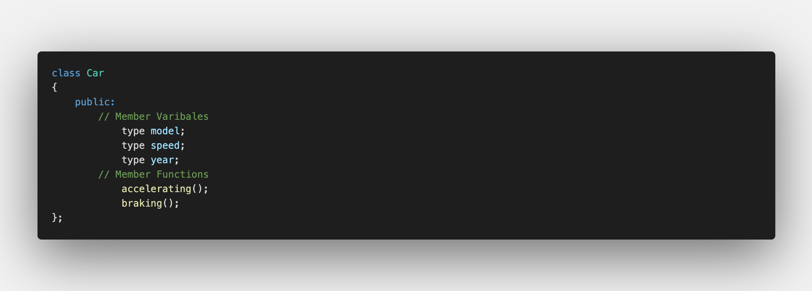
  

  
So using Encapsulation the class "Car" provides a way to encapsulate all of the data and the functions into a single unit called Class

Ofc other parts of the program can interact with the class as well by calling the member function

And they don't need to know the implementaion of the class (Ex: How the speed increase and decrease ... )

 
  

  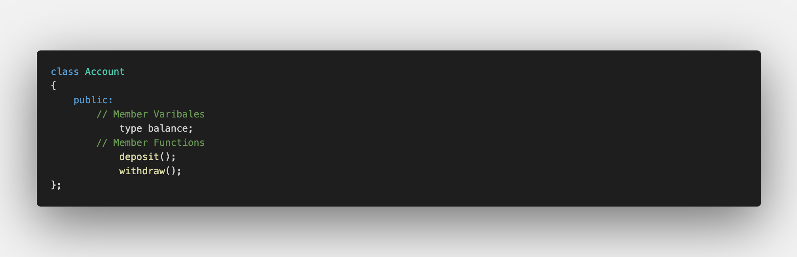
  

  
We can hide the implementation details of how the balance is updated and the validations are done inside the class

And the users of the class can just interact with the class using the deposit and withdraw functions without the need to know how the balance is updated.

> The encapsulation helps to make the code more readable, maintainable and less prone to bugs by limiting the exposure of the implementation details to the other parts of the code.
  
  - Inheritance : OOP allows a new class to inherit the proprties and methods of an existing class, reducing the amount of repetitive code also this allows for the creation of a hierarchy of classes, where a subclass can inherit from a superclass and add or override methods as needed.

  ### Example

  

  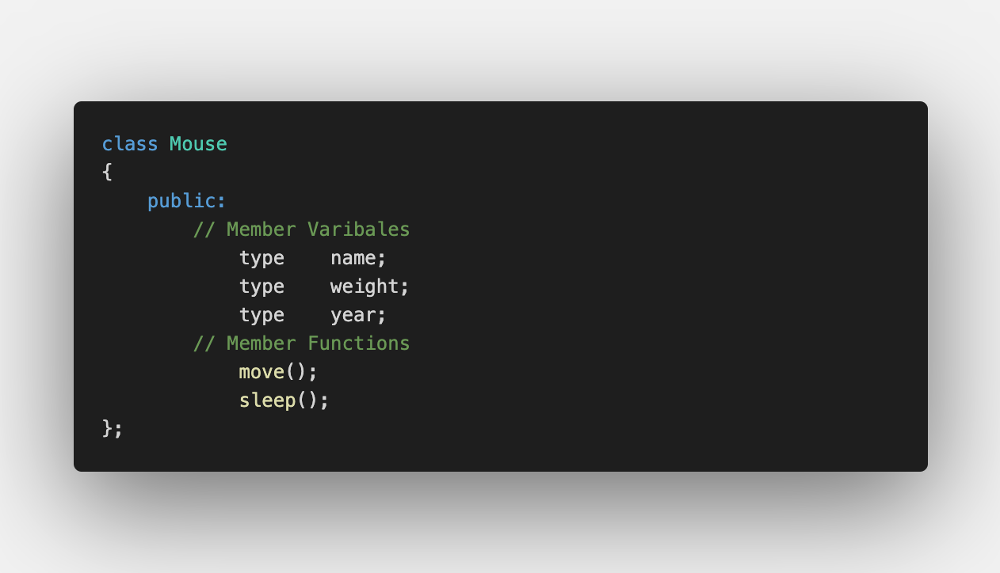
  

  
Let's consider the class "Mouse" that has method called "move()" and member variables like "name" and "weight"

  

  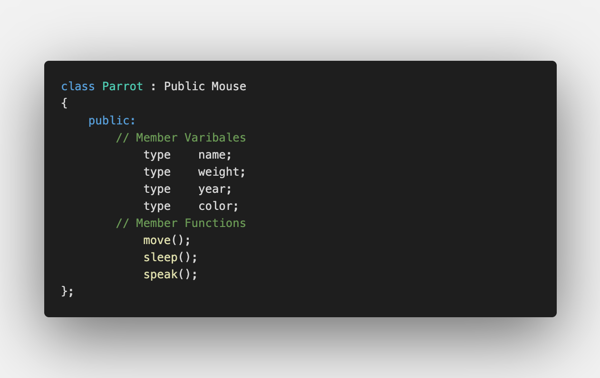
  

We create a subclass called "Parrot" that inherits from the "Mouse" class and add new methods or override existing methods

Then the class "Parrot" have a new method called "speak()" and variable member "color".

> The inheritance allows for creating a hierarchy of classes, where a subclass can inherit the properties and methods of its superclass, and then add or override methods as needed. This can make the code more organized and reusable, and it makes it easier to understand the relationships between classes in the program.

 
# Namespace

  ## Definition
  
  Namespaces are defined using the keyword namespace, and can contain :
  
  - Variables
  - Functions
  - Classes
  - and other namespaces.
  
Once a namespace is defined, its elements can be accessed using the scope resolution operator (::)

تقاد تبان ليك بحال شي صندوق لي تاتخبي فيه داكشي لي باغي ,  نقدوا متلا يكون عندنا Namespace سميتوا Bank لي نقدوا نخبيوا فيه اي حاجة عندها علاقة بالبنك بحال Variables (AccountNbr, Balance) أولا Function (CheckBalance) و حتى  Classess و نقدوا نزيدوا Namespaces اخريين مهم صندوق جامع كلشي . 

  ## Benefits

  Namespaces provide a way to organize code, prevent naming conflicts, and improve code reuse, readability, and maintainability.

  ## Example
 
  

    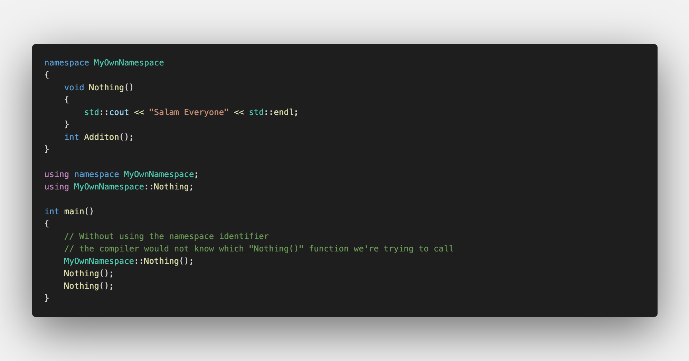
  

> The use of namespace can be convenient in small programs :
> - It allows you to access elements in the namespaces without mention the namespace
> - But it's a BAD PRACTICE in large codebases in a code that will be shared with others (حيتاش داكشي يقد يدير الله يحفظ :sweat_smile:  شي Conflicts)

# Floating Point Representation

To represent the decimal number **172.625** in floating point representation, we will use the [IEEE 754](https://learn.microsoft.com/en-us/cpp/build/ieee-floating-point-representation?view=msvc-170) format. This format includes 3 main components:

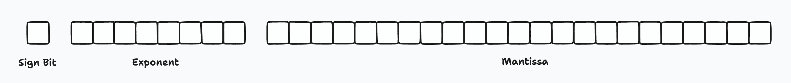

To convert 172.625 to floating-point representation using the IEEE 754 we need to follow these steps:

أول حاجة كانشدوا الرقم و كانحيدوا منو Fractional Part أولا الرقم لي من مور الفاصلة , و من بعد كانحولوه للBinary 

داكشي لي بقا من الرقم و لي هوا العدد لي من مور الفاصلة كانبقاو نضربوه ف2 ونقيدوا يا 0 أولا 1 هادشي كايبقا يتعاود تكنوصلوا لل0 أولا واحد الPattern كاتبقا تعاود.

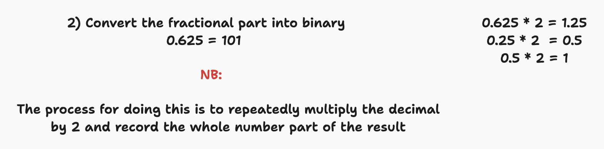

دابا جمع الارقام ب2 وهوما محوليين لل Binary بحال هكا :

دابا المرحلة ديال الExponent خاصنا هنا نحركوا الفاصلة للأقصى اليسار قبل من الرقم 1 كيف ما باين هنايا :

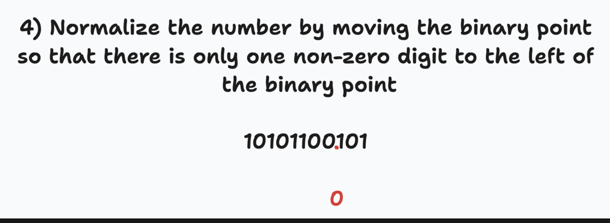

In this case, we need to shift 7 positions to the right. Since the exponent is stored as an 8-bit field, it needs to be represented in excess-127 notation.

So the exponent field will be : 

فالبلاصة ديال Sign ايلا كان الرقم سلبي 1 و ايلا كان ايجابي 0 :

So the final floating-point representation of 172.625 using the IEEE 754 format is:

دابا جمع الSign و الExponent و الMantissa فالحالة ديال Float الMantissa كاتكون 23 Bits و بالنسبة للDouble 52 Bits , ايلا كنتي حولتي الFractional Part للBinary و بقات كاتعاود حبس حد 23 ايلا كانت قل حطهم فالبلاصة ديال Mantessa و لي بقا عمرهم ب 0.

# Operator Overloading

  ## Definition  
  
  Operator (a symbol to perform mathematical and logical computations) overloading is a feature in C++ that allows you to redefine the way operators such as +, -, *, etc, work for user-defined data types such as classes and structs ()
 By making theses operator to work on used defined data types such as class, structs 
  
  :information_source: When the compiler found an operator in your code, it first checks if that operator has been overloaded for the specific data types it is working with : 
  
  - If it has, the compiler will use the overloaded version of the operator.
  - If it hasn't, the compiler will use the default behavior of the operator for the data types in question.

So the compiler needs to handle that operator based on whether it has been overloaded or not.

  ## Types :
  
   - Function Overloading : When 2 functions have the same name but with a diffrent number or type of arguments.
   - Operator Overloading : ...
  
  ℹ️ : Good Practice: Remembre to passed the arguments as const refrence to ensure that the membre function cannot modify the object being passed
  
  ## Advantages and Disadvantages

  ### Advantages :
 
  - Simplicity: Operator overloading can simplify the code by reducing the need for verbose function calls, it makes the code more elegant and readable.

  

    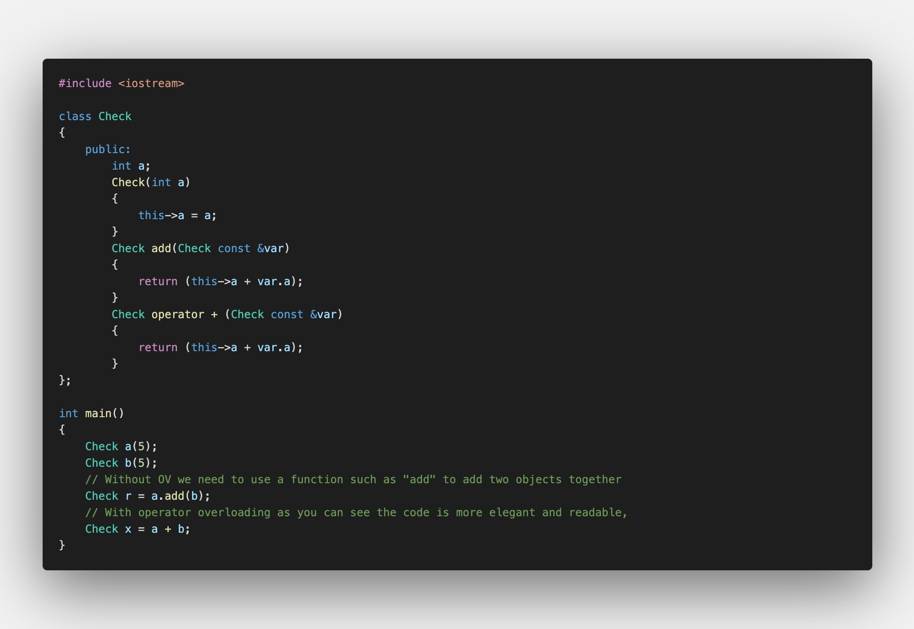
  

  
  As you can see, in the second example the code is more elegant and readable, the operation is simple and intuitive, and it doesn't need to call a function, it's clear that we are adding two objects together

    
  ### Disadvantages :
  
  - New operators can't be overloaded only pre-existing operators can be overloaded.
  - Arity (Nbr of inputs) of the operators can not be changed. For example, the "+" operator can take only two inputs, like 5 + 2. So you can not use it to add three numbers like (a + b + c) meaning that the expression a + b + c is interpreted as (a + b) + c
  
  
  
  ## Syntax :
  
  

  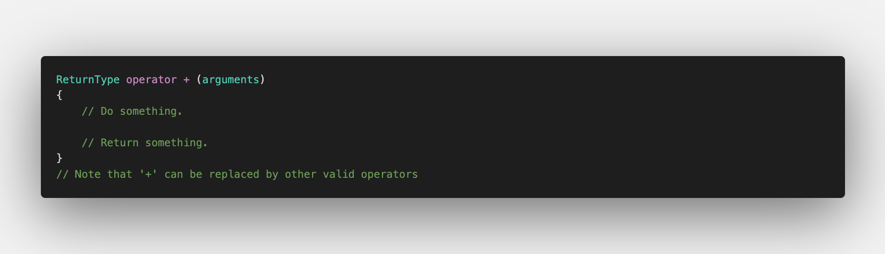
  

 
  ## Example
  
   

    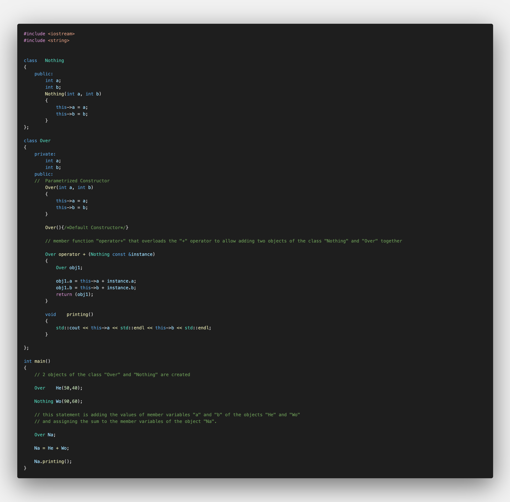
   

# Memory Allocation

  ## Pointers
  
  - As we know a pointer stores the address of another variable 
  
  - When we use a pointer to class in fact we're storing the memory address of an object of that class
  
  - We can change which object the pointer is pointing to during the execution of the program
  
  (شوف غي شي متال ديال شي بروغرام لي كايخليك تختار شنو بغيتي عن طريق input , يعني على حساب داكشي لي ختاريتي ل pointer غادي pointy عليه يعني كايقد يتبدل)
  
  - A pointer can be NULL
  
  ## References
  
  - Is a way to give another name to a variable (بحال شي اختصار اولا شي سمية أخرى ليه)  
  
  - When we use a reference to class, we're creating an alias for an existing object (هادشي كايخلينا نوصلو نيشان ليه بلا "*" )

  - A reference must always be initialized when it is created and it can't be changed to reference another variable after it's been initialized
   
  - A reference can't be NULL 
  
  حيتاش كيف ماقلنا مع كان كانستخدموه خاص يpointer على شي حاجة (صحيح استعملت كلمة لكن مالقيت مانكتب :sweat_smile:	)
  
  
  > Overall, references and pointers are two ways to access the memory location of a variable in C++, with references being a more convenient and safer way to do so.
  > Basically the main difference between a reference and a pointer
   >> - A Pointer has the freedom to move around and point to different variables
   >> - Whereas the reference gets assigned one time, and it just becomes a reference to that location in memory
  ***

## شويا ديال Memory : 

When a function uses a reference, it can directly access the variable without an additional memory fetch.

A pointer, however, must use the indirection operator (*) to access the value of the variable, which requires an additional memory fetch.

A memory fetch refers to the process of retrieving data from memory.

When a program requests data from memory, the CPU sends a memory request to the memory management unit (MMU), which then retrieves the requested data from the physical memory and sends it back to the CPU. This process is called a memory fetch.

For example, when a program wants to access the value of a variable, it sends a memory request to the MMU with the address of the variable, the MMU then retrieves the value stored at that address and sends it back to the CPU. This whole process is called a **Memory Fetch**.

In short, a memory fetch is the process of retrieving data from memory, it's the act of fetching a value from the memory by providing the address of the variable.

  

    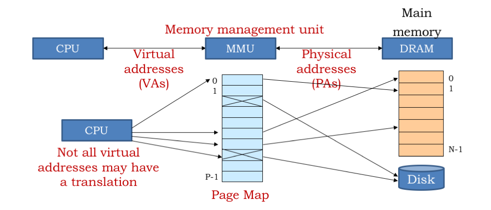
  

فاش كانديكلاريو شي variable الOS كايAllocy لينا Memory للداك الVariable باستعمال Virtual Memory باش نقدوا نخدموا البروغرام , من بعد كايشد MMU داك الMemory و كايدير اش كانسميوا Mapping Or Paging لPhysical Memory Address ف(RAM أولا Hard Disk) هاد  Physical Address هي الActual Location تاع Memory , ادن فاش تبغي تمشي للداك الVariable الCPU كايدير واحد الRequest من Virtual Address تاع الVariable كايجي سي MMU كايترجم ديك الVirtual Address للPhysical Address ()RAM الRAM كايخد ديك الValue لي مخبع تما و كايردها للCPU .

يعني بخلاصة فاش كانبغيو شي Variable كنا قبل خدمناه الMMU كايدير بحال واحد الLien نيشان مع الPhysical Memory من تم الCPU كايAccessy نيشان للVariable و يبدلوا كيف ما بغى
  
  
  
 
# Common Questions 

## Why should i chose to hide member function or member variables ?

Private members in C++ are class members that can only be accessed by the member functions inside the class. This helps to protect data from accidental modifications and changes, as well as preventing unintended or intended changes.

  

    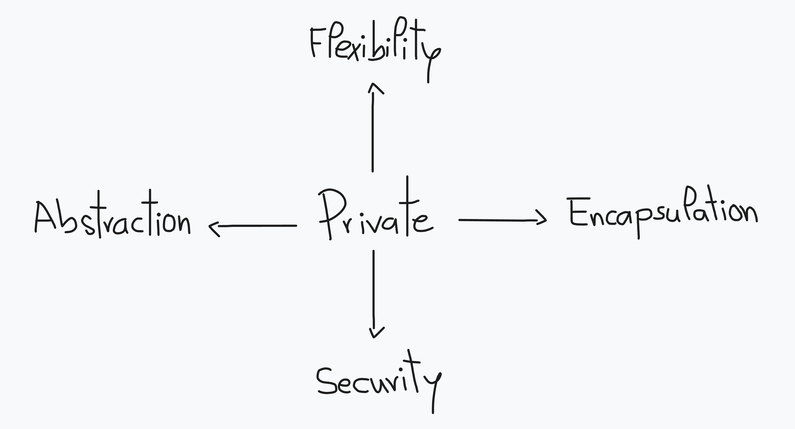
  

- Encapsulation: Hiding the implementation details of a class from other classes can help to protect the integrity of the data and methods within the class, and prevent external classes from making unexpected changes to them.

- Abstraction: By exposing only a limited set of public methods, a class can provide a simplified and more abstract interface to other classes, making it easier to use and understand.

- Flexibility: Making members private allows the implementation of a class to change without affecting other classes that use it, as long as the public interface remains the same.

- Security: By making members private, it is harder for external classes to access and manipulate the data of a class in unintended ways, thus increasing security.

Overall, using private members in C++ helps to promote good software design and maintainable code.

فاش كانختارو نديرو شي Member Variables or Functions يكون Private يعني كانمنعو الClassess الاخرين باش مايAccessiw للدلك Attribute, هادشي كايعاون على اننا نحميوا من أي تغيير يقد يطرا مقصود اولا لا , و من زاوية اخرى تقد تشوفها على أننا كان Limitiw Scope ديال أي تغيير نبغيو نديروه حيتاش كانخدموا غير فالClass ديالنا.

## Operator Overloading : 

As we’ve seen, the IO library uses >> and << for input and output :

  

    
  

## Overloading the Output Operator <<

  

    >.png" width="700">
  

## Overloading the Output Operator >>

# Diffrence between Copy 

A copy constructor and a copy assignment operator are both used to make a copy of an object in C++. The difference is when you use them.

## Copy constructor :

Is used when you first make a new object and you want to make a copy of it.

## Copy assignment operator:

Is used when you already have an object and you want to make a copy of it into a different object.

It's like making a copy of a picture. The copy constructor is like making a new picture right away, while the copy assignment operator is like taking an old picture and making a copy of it.

# Errors and solutions

  

    
  

